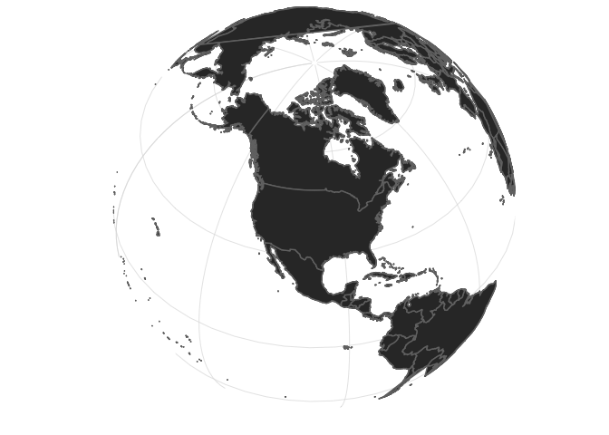
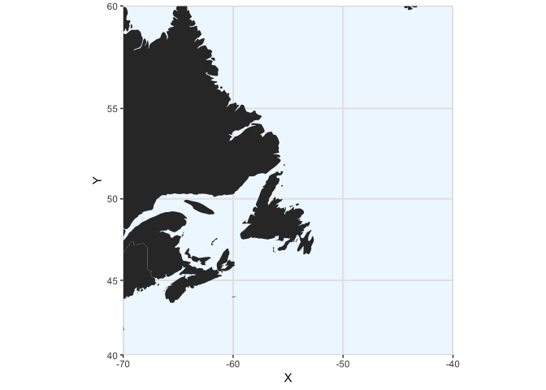
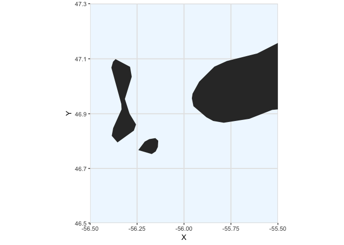
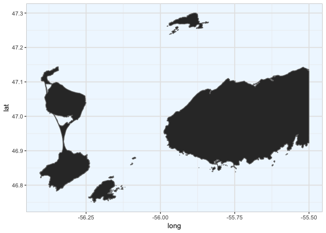

Carte Golfe du St Laurent & St Pierre et Miquelon
================
A. Boyé
04 avril, 2019

-   [Packages](#packages)
-   [Carte du monde centré sur le canada](#carte-du-monde-centré-sur-le-canada)
-   [Carte zoomée sur Golfe du Saint Laurent](#carte-zoomée-sur-golfe-du-saint-laurent)
-   [Carte zoomée sur St Pierre](#carte-zoomée-sur-st-pierre)
    -   [Version `maps`](#version-maps)
    -   [Version `Openstreetmap`](#version-openstreetmap)
-   [Session info](#session-info)

------------------------------------------------------------------------

Packages
========

``` r
library(ggplot2)
library(PBSmapping) 
library(data.table)
library(rgdal)
library(raster)
```

Carte du monde centré sur le canada
===================================

``` r
world <- map_data("world")

worldmap <- ggplot(world, aes(x=long, y=lat, group=group)) 
worldmap <- worldmap + geom_path()
worldmap <- worldmap + scale_y_continuous(breaks=(-2:2) * 30) 
worldmap <- worldmap + scale_x_continuous(breaks=(-4:4) * 45)
worldmap <- worldmap + coord_map("ortho", orientation=c(44, -100, 0)) + ylab("") + xlab("")
worldmap <- worldmap + geom_polygon(data=world, mapping=aes(x=long, y=lat,group=group),col="gray45") 
worldmap <- worldmap + theme_light() + theme(axis.text=element_blank(),axis.ticks=element_blank(),panel.border=element_blank())

worldmap
```



------------------------------------------------------------------------

Carte zoomée sur Golfe du Saint Laurent
=======================================

``` r
world <- map_data("world")

setnames(world,c("X","Y","PID","POS","region","subregion"))

xlim <- c(-70,-40)
ylim <- c(40,60)

worldmap <- clipPolys(world, xlim=xlim,ylim=ylim, keepExtra=TRUE)

p <- ggplot() 
p <- p + coord_map(xlim=xlim,ylim=ylim) 
p <- p + geom_polygon(data=worldmap,aes(X,Y,group=PID))
p <- p + theme_bw() + theme(panel.background = element_rect(fill = "aliceblue", colour = "grey"),panel.grid.major = element_line(colour = "gray90",size=.7),panel.border=element_blank())

p
```



------------------------------------------------------------------------

Carte zoomée sur St Pierre
==========================

Version `maps`
--------------

``` r
world <- map_data("world")

setnames(world,c("X","Y","PID","POS","region","subregion"))

xlim <- c(-56.5,-55.5)
ylim <- c(46.5,47.3)

worldmap <- clipPolys(world, xlim=xlim,ylim=ylim, keepExtra=TRUE)


p <- ggplot() 
p <- p + coord_map(xlim=xlim,ylim=ylim) 
p <- p + geom_polygon(data=worldmap,aes(X,Y,group=PID))
p <- p + theme_bw() + theme(panel.background = element_rect(fill = "aliceblue", colour = "grey"),panel.grid.major = element_line(colour = "gray90",size=.7),panel.border=element_blank())

p
```



Version `Openstreetmap`
-----------------------

### Crop Openstreetmap polygon layer

`land_polygons` was downloaded from openstreetmapdata.com which offers extracts and processings of OpenStreetMap data.

See <http://openstreetmapdata.com/> for details.

Layers contained are:

land\_polygons.shp:

598199 Polygon features WGS84 geographic coordinates Extent: (-180.000, -90.000) - (180.000, 83.666)

Date of the data used is 28 Oct 2017 04:45

You can find more information on this data set at

<http://openstreetmapdata.com/data/land-polygons>

> ### LICENSE
>
> This data is Copyright 2017 OpenStreetMap contributors. It is available under the Open Database License (ODbL).
>
> For more information see <http://www.openstreetmap.org/copyright>

This layer being to heavy, it was not included in this Github repository, only the cropped layer is. To crop the intial layer, the following code was used.

``` r
# Read land_polygons.shp from the current working directory (".")
poly_layer <- readOGR(dsn=".",layer = "land_polygons")

# Crop the layer to the desired extent
poly_layer_cropped <- crop(poly_layer,extent(-56.5,-55.5,46.5,47.3))

# Save the cropped layer
writeOGR(poly_layer_cropped, ".", "land_polygons_cropped", driver="ESRI Shapefile")
```

### Map with the cropped layer

``` r
# Read land_polygons.shp from the current working directory (".")
poly_layer <- readOGR(dsn=".",layer = "land_polygons_cropped")
```

    ## OGR data source with driver: ESRI Shapefile 
    ## Source: "/Users/aboye/Documents/Boulot/Chunk_code/Cartographie/Map_st_pierre", layer: "land_polygons_cropped"
    ## with 109 features
    ## It has 1 fields

``` r
# Project the layer in WGS84 (if you want to change projection)
poly_proj <- spTransform(poly_layer, CRS("+init=epsg:4326"))

p <- ggplot() 
p <- p + geom_polygon(data=poly_proj,aes(long,lat,group=id),col="gray45") 
p <- p + theme_bw() + theme(panel.background = element_rect(fill = "aliceblue", colour = "grey"),panel.grid.major = element_line(colour = "gray90",size=.7),panel.border=element_blank())
p
```



------------------------------------------------------------------------

Session info
============

``` r
sessionInfo()
```

    ## R version 3.5.1 (2018-07-02)
    ## Platform: x86_64-apple-darwin15.6.0 (64-bit)
    ## Running under: macOS High Sierra 10.13.6
    ## 
    ## Matrix products: default
    ## BLAS: /Library/Frameworks/R.framework/Versions/3.5/Resources/lib/libRblas.0.dylib
    ## LAPACK: /Library/Frameworks/R.framework/Versions/3.5/Resources/lib/libRlapack.dylib
    ## 
    ## locale:
    ## [1] fr_FR.UTF-8/fr_FR.UTF-8/fr_FR.UTF-8/C/fr_FR.UTF-8/fr_FR.UTF-8
    ## 
    ## attached base packages:
    ## [1] stats     graphics  grDevices utils     datasets  methods   base     
    ## 
    ## other attached packages:
    ## [1] maps_3.3.0        raster_2.6-7      rgdal_1.3-4       sp_1.3-1         
    ## [5] data.table_1.11.4 PBSmapping_2.70.5 ggplot2_3.0.0    
    ## 
    ## loaded via a namespace (and not attached):
    ##  [1] Rcpp_1.0.1       pillar_1.3.0     compiler_3.5.1   plyr_1.8.4      
    ##  [5] bindr_0.1.1      tools_3.5.1      digest_0.6.15    lattice_0.20-35 
    ##  [9] evaluate_0.13    tibble_1.4.2     gtable_0.2.0     pkgconfig_2.0.1 
    ## [13] rlang_0.3.1      rstudioapi_0.7   yaml_2.2.0       xfun_0.5        
    ## [17] bindrcpp_0.2.2   withr_2.1.2      dplyr_0.7.6      stringr_1.4.0   
    ## [21] knitr_1.22       grid_3.5.1       tidyselect_0.2.4 glue_1.3.1      
    ## [25] R6_2.4.0         rmarkdown_1.12   purrr_0.2.5      magrittr_1.5    
    ## [29] codetools_0.2-15 scales_0.5.0     htmltools_0.3.6  assertthat_0.2.0
    ## [33] colorspace_1.3-2 labeling_0.3     stringi_1.4.3    lazyeval_0.2.1  
    ## [37] munsell_0.5.0    crayon_1.3.4
